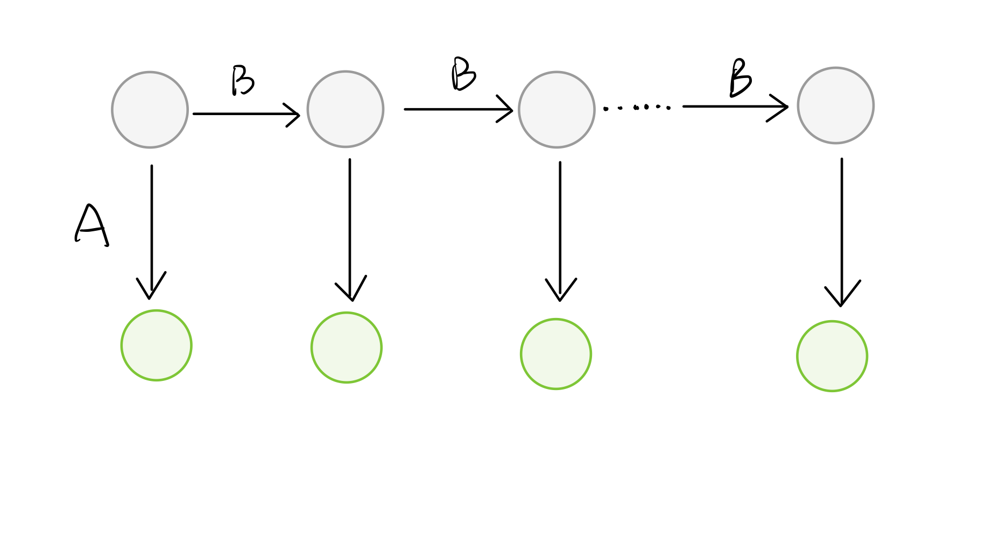
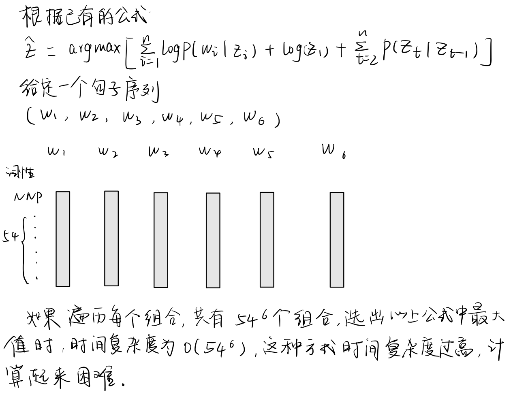
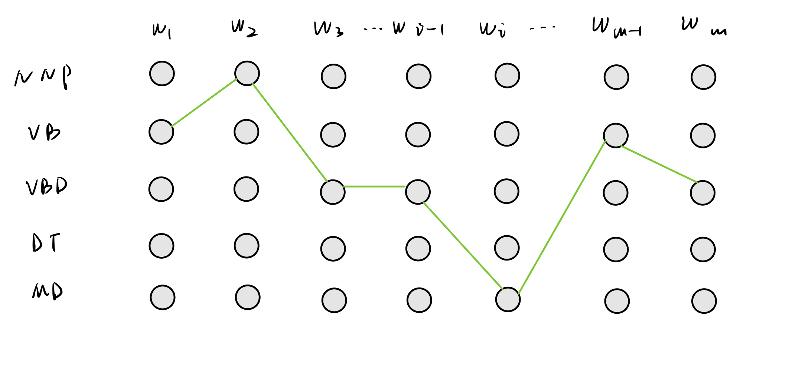

# 词性标注 part-of-speech

## 任务描述
给定一个字符序列，标注出每个字符的词性
$$S = w_1,w_2.w_3,w_4,w_5$$
$$Z=z_1,z_2,z_3,z_4,z_5$$

## 解决方法
现根据标注好的词性表进行训练，之后根据输入的字符序列，标注出各个字符对应的词性
$$S'=w_1',w_2',w_3',w_4',w_5'$$
$$Z'=?$$

## 理论基础
**Noisy Channel Model**
$$\begin{align}P(Z|S) &\propto P(S|Z)P(Z)\\
&=P(w_1w_2w_3...w_n|z_1z_2z_3...z_n)P(z_1z_2z_3...z_n)\\
&=\prod_{i=1}^nP(w_i|z_i)\cdot P(z_1)P(z_2|z_1)...P(z_n|z_{n-1})
\end{align}$$
其中$\prod_{i=1}^nP(w_i|z_i)$被称为是条件概率，$P(z_1)P(z_2|z_1)...P(z_n|z_{n-1}$是语言模型。
$$\begin{align}
\hat Z &= argmaxP(Z|S)\\
&=argmax\prod_{i=1}^nP(w_i|z_i)\cdot P(z_1)\prod_{j=2}^nP(z_j|z_{j-1})\\
&\propto log(\prod_{i=1}^nP(w_i|z_i)\cdot P(z_1)\prod_{j=2}^nP(z_j|z_{j-1}))\\
&=argmax\sum_{i=1}^nlog(w_i|z_i)+logP(z_1)+\sum_{j=2}^nlogP(z_j|z_{j-1})
\end{align}$$
为了求出$\hat Z$则需要计算上述公式，我们需要计算$\sum_{i=1}^nlog(w_i|z_i)$，$logP(z_1)$，$\sum_{j=2}^nlogP(z_j|z_{j-1})$，分别记为$A, \pi, B$。

实际上，这就是一个简单的HMM模型，B是状态转移矩阵（transition matrix），从一个状态，转移到另一个状态，这里对应的就是词性的状态数，假设我们有N个词性，则B的形状为`NxN`。A是发射矩阵（emission matrix），是观测值（上图浅绿色）和状态（上图灰色）部分的联合矩阵，假设我们有N个词性状态，M个单词，那么A矩阵的形状为`NxM`。$\pi$则是一个1xN维的状态矩阵，表示每个状态出现在第一个时刻的概率。

我们的目的就是要从词性单词矩阵中找到一条合适路径，能使得上图中的公式，得到最大化的结果，为了降低上面过程的时间复杂度，我们采用维特比算法来解决该问题。

## 示例代码

相关代码请参考`词性标注实战.ipynb`文件。

