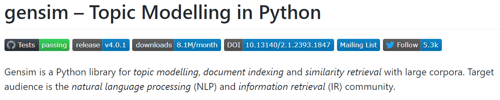
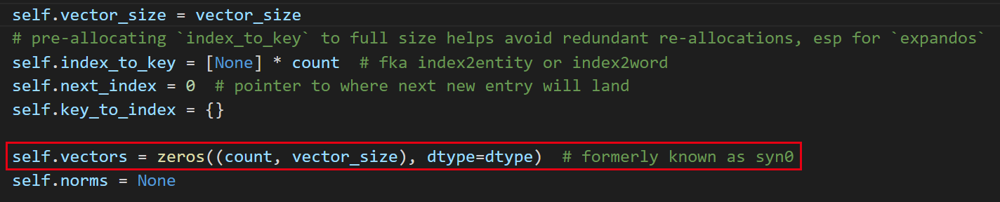
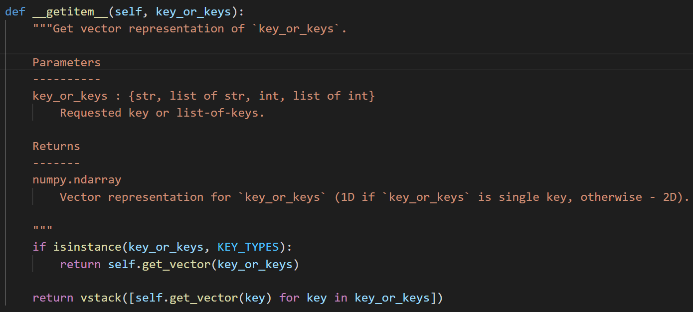

# 使用gensim生成Word2Vec词向量

## 前言

word2vec是一个重要的生成词向量的算法，生成词向量的分布式表示有很大的效果提升。

邱锡鹏教授在他的知乎上，分享过关于word2vec的见解，

> Word2vec训练方面采用的HSoftmax以及负采样确实可以认为是创新不大。但Word2vec流行的主要原因也不在于此。主要原因在于以下3点：1. 极快的训练速度。以前的语言模型优化的目标是MLE，只能说词向量是其副产品。Mikolov应该是第一个提出抛弃MLE（和困惑度）指标，就是要学习一个好的词嵌入。如果不追求MLE，模型就可以大幅简化，去除隐藏层。再利用HSoftmax以及负采样的加速方法，可以使得训练在小时级别完成。而原来的语言模型可能需要几周时间。2. 一个很酷炫的man-woman=king-queen的示例。这个示例使得人们发现词嵌入还可以这么玩，并促使词嵌入学习成为了一个研究方向，而不再仅仅是神经网络中的一些参数。3. word2vec里有大量的tricks，比如噪声分布如何选？如何采样？如何负采样？等等。这些tricks虽然摆不上台面，但是对于得到一个好的词向量至关重要。举一个生活中的例子，语言模型和word2vec的关系可以类比于单反相机和美颜手机，它们的受众不一样。就照片质量（MLE）而言，单反肯定好。但如果更关心美颜（词嵌入）和便携性（训练速度），美颜手机就更受欢迎。
>
> 作者：邱锡鹏
> 链接：https://www.zhihu.com/question/53011711/answer/139280504
> 来源：知乎
> 著作权归作者所有。商业转载请联系作者获得授权，非商业转载请注明出处。

上述论述里需要纠正一点的是，Mikolov提出的word2vec[^1]并非是第一个提出抛弃MLE指标，目的就是要学习一个好的词嵌入的工作，但是word2vec应该说是最有名的一篇工作。

关于词向量的相关介绍，在这里不做过多介绍，感兴趣的朋友可以移步到我的[知乎文章](https://zhuanlan.zhihu.com/p/344474638)中去了解相关的知识。

## 工具介绍



使用[gensim](https://github.com/RaRe-Technologies/gensim)作为主要的工具来生成word2vec词向量。

gensim是一个自然语言处理工具包，主要用于主题建模，文本索引和相似度检索。实现了很多流行的算法，比如潜在语义分析LSA，LDA和word2vec等。

本讲主要介绍gensim中的word2vec模块的内容，该算法包括跳字模型和连续词袋模型，都使用了层次化softmax和负采样技术进行优化。

这里有几篇文章来做参考，[gensim基础教程](https://radimrehurek.com/gensim/models/word2vec.html)，[gensim高阶教程](https://rare-technologies.com/word2vec-tutorial/)以供诸君参考。

## 训练过程

1. 安装

```python
pip install gensim
```

2. 模型训练

```python
from gensim.test.utils import coomon_texts
from gensim.models import Word2Vec
model = Word2Vec(sentence = common_texts, vector_size=100, window=5, min_count=1, worker=4)
model.save("word2vec.model")
```

**注意：**

**这里的sentence最好是一个可迭代的对象，或者是一个迭代器，这样如果无监督训练文本较大时，可以按照stream的方式逐渐流入内存中，”读入，训练，抛弃“循环往复，能够最大化节省内存空间。**

示例代码如下所示，仅供参考

```python
class MySentences(object):
    def __init__(self, dirname):
        self.dirname = dirname
 
    def __iter__(self):
        for fname in os.listdir(self.dirname):
            for line in open(os.path.join(self.dirname, fname)):
                yield line.split()
 
sentences = MySentences('/some/directory') # a memory-friendly iterator
model = gensim.models.Word2Vec(sentences)
```

输入模型中的数据参考下面的数据结构

```
[["hello","world"],
["how","are","you"],
["what","do","you","think","about","it"]]
```

3. 保存模型后重新加载训练

```python
model = Word2Vec.load("word2vec.model")
model.train([["Hello","world"]], total_examples=1, epoches=1)
```

4. 词向量

训练好的词向量被保存在`KeyedVectors`对象中。可以通过如下方式取得某个词对应的向量，

```python
vector = model.wv['computer']#得到computer对应的向量表示，格式是numpy向量
sim = model.wv.most_similar('computer',topn=10)# 取得最相似的前十个单词
```

5. 单独保存词向量

训练完成后，往往不需要继续保存模型，下游任务只需要词向量，因此我们可以单独保存向量，而抛弃模型。

```python
from gensim.models import KeyedVectors
word_vectors = model.wv
word_vectors.save("word2vec.wordvectors")

wv = KeyedVectors.load("word2vec.wordvectors", mmap='r')
vector = wv['computer']
```

6. 关于词向量的进一步说明

通过阅读源码，我们发现，词向量被保存在`model.wv.vectors`变量中，



可以通过下面的代码取得参数矩阵。

```python
model.wv.vectors
```

第二种方式，我们可以直接向`model.wv`传入参数来取得目标词的词向量，源代码中定义了`__getitem__`函数，可以直接通过索引的方式取到目标向量。



通过上图中的注释，我们了解到可以传入字符串，字符串列表，数值，数值列表，如果是单值则只返回一维向量，如果是列表则返回二维向量。

因此使用过程中，我们可以直接通过`model.wv[args]`取到目标向量。

7. 几个重要的训练的参数说明

**min_count**

对内部词典进行剪枝，在上百万上千万词的数据集中，只出现一两次的单词显然是没有可能出现合理的词向量表示的，所以最好的处理方式就是忽略他们。因此通过定义`min_count`参数，可以对词典进行剪枝。

```
model = Word2Vec(sentences, min_count=10)  # default value is 5
```

**size**

该参数定义了训练后的词向量的维度，该参数大小反映了算法的自由度，该值越大则需要越多的训练数据，也能产生更好的，更精确的模型。

```
model = Word2Vec(sentences, size=200)  # default value is 100
```

**workers**

定义并行化程度，来加速训练。

```
model = Word2Vec(sentences, workers=4) # default = 1 worker = no parallelization
```

若想使用该参数，则需安装cpython，如果没有cpython，只能使用单核处理，训练速度会变慢。

## 收获

经过本次实验过程中查阅资料，发现以往对词向量的认识还是有一些错漏之处，这里纠正一下以往的错误理解。

1. **提问：词向量到底是什么东西呢？是输入模型中的初始输入吗？**

   答：<font color='red'>字/词向量其实就是和输入one-hot向量直接相连的全连接层的参数矩阵的内容而已</font>，这个全连接层矩阵参数就是一个以词表为行数，隐层向量数目为列数的参数表。每个词对应该矩阵中的某一行。

2. **提问：训练词向量为什么一般采用无监督的方式？还有其他办法来获得词向量吗？**

   其实训练词向量有非常多的方法和结构，完全取决于你的下游任务，哪怕是文本分类任务，实体识别任务都可以，关键是最终得到全连接层的参数矩阵。虽然是这样，但是由于很多下游任务数据量很小，带来的问题就是，很容易过拟合。因此一般先采用大规模的无监督语料训练初始的词向量，减低过拟合风险。后续在下游任务再进行微调即可。<font color='red'>由于无监督语料的规模很大，因此可以有效降低过拟合风险。</font>

3. **提问：为什么词向量会具有相似上下文的词向量夹角余弦、向量欧氏距离更接近，体现出相似性？**

   来源于Harris提出的分布假说（distributional hypothesis），即“上下文相似的词，其语义也相似”。在词向量中，由于我们的训练过程是有窗口的，每次相同窗口内的词对应的参数矩阵的相应位置会一同得到更新，这种更新会随着窗口内类似词语的共现次数的增加，而不断积累，最终训练好的词向量会非常接近。比如，“美丽的鲜花”，美丽和鲜花在大规模的预料中，共现频率很高，因此在词向量联系空间中距离会相近。


## References

[^1]: 1 Mikolov, T., Sutskever, I., Chen, K., Corrado, G. S., and Dean, J. (2013b). Distributed representations of words and phrases and their compositionality. In Advances in Neural Information Processing Systems, pages 3111–3119.


